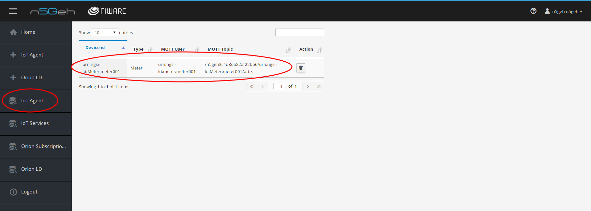

# N5GEH tutorial for ENTIRETY 

This is a tutorial of how to use ENTIRETY for device provisioning for the N5GEH Cloud Platform. To demonstrate the work of the components everything is configured locally. To start using the tutorial it is necessary to install Pre-requisites.

## Pre-requisites 
* Docker engine
* Docker compose

## Manual

### Start

```bash
./services start
```
This command starts all services from the docker-compose file and run setup for the demo.

### Set of services

The picture below shows the set of services for the tutorial.
<p align="center">

</p>

### List of the service

Here is the list of the services:
- [KeyCloak](http://localhost:8080) with login: **admin** and password: **Pa55w0rd**
- [Entirety](http://localhost:8090) with login: **n5geh** and password: **n5geh**
- [Grafana](http://localhost:3003) with login: **admin** and password: **admin**

### Initializing the services

To start using services it is MANDATORY to provide a CLIENT_SECRETS from the Keycloak Identity Manager.

#### Initializing services

Login to the Keycloak Admin dashboard via [KeyCloak](http://localhost:8080) with login: **admin** and password: **Pa55w0rd**.


#### Update client secrets for Entirety

Regenerate the Client Secret for Entirety and rewrite it in the configuration file.


#### Update client secrets for MQTT Broker

Regenerate the Client Secret for MQTT Broker and rewrite it in the configuration file.


#### Restart services with updated keys

To apply changes it is necessary to restart docker containers with services. 

```bash
./services secrets_update
```

## Entirety

### Login page

Now, the ENTIRETY service should be available via this [Entirety](http://localhost:8090) with login: **n5geh** and password: **n5geh**.


### Dashboard
Here is a ENTIRETY Dashboard.


### Initialize classes


### Initialize subscriptions


### User preferences


### Add/Remove device

Entirety supports two type of Datamodel definition: NGSIv2 and NGSI-LD.
Because IoT Agent currently does not support NGSI-LD than in this tutorial we are showing an example with NGSIv2.

Here is definition of the Meter in the Datamodel:
```javascript
{
  "base_template": "base/Device.json",
  "device_id": {
    "name": "device_id",
    "label": "Device Id",
    "required": "true",
    "prefix": "urn:ngsi-ld:Meter:"
  },
  "entity_name": "",
  "entity_type": "Meter",
  "attributes": [
    {
      "object_id": "nam",
      "name": "name",
      "type": "String"
    },
    {
      "object_id": "lis",
      "name": "listening",
      "type": "String"
    },
    {
      "object_id": "sam",
      "name": "sampleRate",
      "type": "String"
    },
    {
      "object_id": "wri",
      "name": "writable",
      "type": "String"
    },
    {
      "object_id": "saI",
      "name": "sampleInterval",
      "type": "String"
    },
    {
      "object_id": "loI",
      "name": "loggingInterval",
      "type": "String"
    }
  ],
  "commands": [],
  "static_attributes": [
    {
      "name": "subCategory",
      "label": "Sub Category",
      "type": "Property",
      "value": "GridRelated",
      "required": "true"
    },
    {
      "name": "hasChannel",
      "label": "Channel",
      "type": "Relationship",
      "value": "",
      "query": "Channel",
      "required": "true"
    },
    {
      "name": "isMeasuredIn",
      "type": "Relationship",
      "label": "Measure",
      "value": "",
      "query": "Measurement",
      "required": "true"
    }
  ]
}
```
And also definition of Device (base object for all devices).
```javascript
{
  "protocol": "",
  "timezone": "",
  "attributes": [
    {
      "object_id": "crA",
      "name": "createdAt",
      "type": "datetime"
    },
    {
      "object_id": "moA",
      "name": "modifiedAt",
      "type": "datetime"
    },
    {
      "object_id": "cat",
      "name": "category",
      "type": "String"
    },
    {
      "object_id": "ipA",
      "name": "ipAddress",
      "type": "String"
    },
    {
      "object_id": "ipA",
      "name": "ipAddress",
      "type": "String"
    },
    {
      "object_id": "coA",
      "name": "controlAsset",
      "type": "String"
    },
    {
      "object_id": "enV",
      "name": "entityVersion",
      "type": "String"
    },
    {
      "object_id": "seN",
      "name": "serialNumber",
      "type": "String"
    },
    {
      "object_id": "suN",
      "name": "supplierName",
      "type": "String"
    },
    {
      "object_id": "des",
      "name": "description",
      "type": "String"
    },
    {
      "object_id": "sou",
      "name": "source",
      "type": "String"
    },
    {
      "object_id": "daP",
      "name": "dataProvider",
      "type": "String"
    }
  ],
  "static_attributes": [
    {
      "name": "hasState",
      "type": "Relationship",
      "label": "State",
      "query": "State",
      "required": "true"
    },
    {
      "name": "controlsProperty",
      "type": "Relationship",
      "label": "Property",
      "query": "Property",
      "required": "true"
    },
    {
      "name": "isMeasuredIn",
      "type": "Relationship",
      "label": "Measurement",
      "query": "Measurement",
      "required": "true"
    },
    {
      "name": "hasCommand",
      "type": "Relationship",
      "label": "Command",
      "query": "Command",
      "required": "true"
    },
    {
      "name": "hasFunction",
      "type": "Relationship",
      "label": "Function",
      "query": "Function",
      "required": "true"
    },
    {
      "name": "conssistOf",
      "type": "Relationship",
      "label": "Consist of",
      "query": "",
      "required": "false"
    }
  ]
}
```
Entirety uses this data to prepare the web form and generate final object for the device.
Here is an example of registering the device.





### Services


### Notifications


### Send a MQTT message

According to registered device:

* Username **urn:ngsi-ld:meter:meter001**
* Password **secret**
* Topic **/n5geh3c4d3da22af22bb6/urn:ngsi-ld:Meter:meter001/attrs**

In this tutorial we are using IoT Agent UL version.

```python
#!/usr/bin/env python3

import paho.mqtt.client as mqtt

client = mqtt.Client()
client.username_pw_set("urn:ngsi-ld:meter:meter001", "secret")
client.connect("localhost", 1883, 60)
client.publish("/n5geh3c4d3da22af22bb6/urn:ngsi-ld:Meter:meter001/attrs", "sou|1");
client.disconnect();
```

#### Data

The data goes to the CrateDB and stores in the table 'mtopeniot.etmeter'.

### Stop

To stop the tutorials please run following command:

```bash
./services stop
```